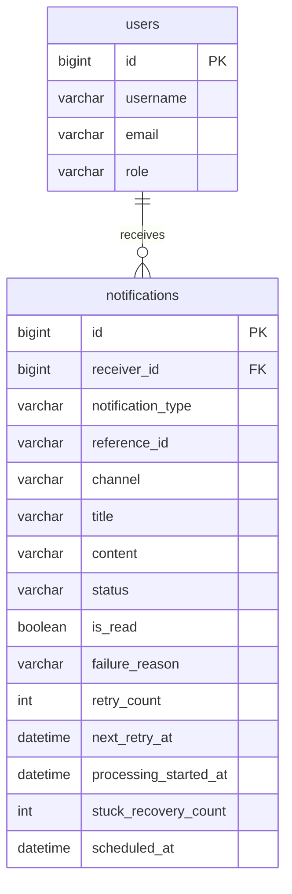

# notification-system

## 프로젝트 개요

LiveKlass 과제 C — **알림 발송 시스템**입니다.

수강 신청·거절·취소 등 비즈니스 이벤트 발생 시 EMAIL / IN_APP 알림을 **비동기**로 발송합니다. API는 알림을 PENDING으로 접수만 하고, 실제 발송은 스케줄러·Worker가 처리합니다. 비즈니스 트랜잭션과 알림 생성·발송은 분리되어, 알림 실패가 수강 등 본업무 커밋에 영향을 주지 않습니다.

**구현 범위 요약**

- 필수: 알림 API, 상태·재시도·DEAD, 중복 방지, 비동기 발송, 운영(스턱 복구·다중 인스턴스)
- 선택: 메시지 Factory, 예약 발송(`scheduledAt`), 읽음 처리, DEAD 수동 재시도
- 샘플 비즈니스: 수강(enrollment) API — 강의/결제는 enum·패턴으로 확장 가능

---

## 기술 스택

| 구분 | 기술 |
|------|------|
| Language | Java 17 |
| Framework | Spring Boot 3.5, Spring Data JPA, Spring Validation |
| Database | MySQL |
| Build | Gradle |
| Test | JUnit 5, Mockito, Spring Boot Test |
| 기타 | Lombok, `@Scheduled`, `@Async` |

---

## 실행 방법

```bash
./gradlew bootRun
```

**사전 조건**

- MySQL `notification` DB (`application.yml` 참고)
- 기동 시 `users`가 비어 있으면 테스트 사용자(id=1) 자동 생성
- `ddl-auto: create` — 재기동 시 테이블 재생성

**확인**

- Base URL: `http://localhost:8080`
- API 예시는 [API 목록 및 예시](#api-목록-및-예시) 참고

---

## 요구사항 해석 및 가정

### 해석

| 과제 요구 | 해석·구현 |
|-----------|-----------|
| 즉시 발송 아님 | POST → 202 + PENDING 저장. 발송은 Worker |
| 비즈니스 TX 분리 | `AFTER_COMMIT` 이벤트 + `REQUIRES_NEW` 알림 생성. 예외 삼키기 X |
| 재시도 | FAILED + `nextRetryAt`, 3회 초과 DEAD, `failureReason` 기록 |
| 중복 방지 | UK + exists, 동시 요청 UK→409 |
| MQ 없이 운영 전환 | DB 상태 + 폴링(Outbox 유사) → Kafka Consumer로 교체 가능 |
| 운영 | PROCESSING 스턱 복구, 재시작 후 DB 잔존 알림 재처리, SKIP LOCKED |
| 선택: 예약 | `scheduledAt` null=즉시, 미래=claim 제외 |
| 선택: 읽음 | `PATCH /read` 멱등 |
| 선택: DEAD 재시도 | `POST /retry`, retryCount=0 리셋 |

### 가정

- **User(id=1)** 이 Postman 테스트용 수신자로 존재한다.
- **referenceId** 는 Course 엔티티 없이 문자열(예: `course-1`)로 관리한다.
- **실제 이메일/푸시** 는 보내지 않고 `LoggingNotificationSender`로 Mock(로그)한다.
- **메시지 브로커** 는 설치하지 않으며, DB 폴링으로 대체한다.
- **수강 도메인** 만 API로 구현하고, 강의/결제는 동일 이벤트 패턴으로 확장 가능하다고 가정한다.
- **인증/권한** 은 과제 범위外 — `receiverId`는 요청 body/query로 전달한다.

---

## 설계 결정과 이유

### 1. 비동기: API vs Worker

- **결정**: API는 PENDING 접수만, `@Scheduled`(5초) + Worker가 발송
- **이유**: API 스레드와 발송 I/O 분리(과제 필수). MQ 없이도 DB만으로 재시작·재처리 가능

### 2. 비즈니스 TX ↔ 알림 생성 분리

- **결정**: `NotificationRequestedEvent` + `@TransactionalEventListener(AFTER_COMMIT)` + `NotificationCreationService(REQUIRES_NEW)`
- **이유**: 수강 커밋 후 알림 생성. 알림 INSERT 실패가 수강 롤백을 유발하지 않음

### 3. 선점(claim) + SKIP LOCKED

- **결정**: `FOR UPDATE SKIP LOCKED`로 PENDING/FAILED 1건 선점 → PROCESSING. claim TX와 발송 TX 분리(`REQUIRES_NEW`)
- **이유**: 다중 인스턴스 중복 발송 방지. 발송 I/O 동안 row 잠금 최소화

### 4. 채널별 발송

| 채널 | 결정 |
|------|------|
| IN_APP | 생성 직후 `@Async` dispatch 1회 + 스케줄러 백업 |
| EMAIL | 스케줄러만 |

### 5. 중복 방지

- **결정**: UK `(receiver_id, notification_type, reference_id, channel)` + 사전 exists + UK→409
- **이유**: 순차·동시 요청 모두 동일 이벤트 1건만 PENDING

### 6. 재시도·DEAD·스턱

| 항목 | 정책 |
|------|------|
| 자동 재시도 | 최대 3회, 간격 1분 |
| DEAD | retryCount ≥ 3 또는 스턱 복구 3회 초과 |
| 스턱 | PROCESSING 10분+ → PENDING/FAILED 복구 |
| 수동 재시도 | DEAD → PENDING, retryCount=0 |

### 7. 메시지 템플릿

- **결정**: `NotificationMessageFactory`(코드) — EMAIL/IN_APP 포맷 분기
- **이유**: 과제 범위에 맞게 단순화. DB CRUD 템플릿은 확장 시점

### 아키텍처 흐름

```
EnrollmentService (@Transactional)
  → publishEvent
NotificationRequestedEventListener (AFTER_COMMIT)
  → NotificationCreationService (REQUIRES_NEW) → PENDING
  → [IN_APP & 즉시] NotificationDispatchTrigger (@Async)
NotificationDispatchScheduler (5초)
  → claim (SKIP LOCKED) → Worker → Mock Sender → SUCCESS/FAILED
```

---

## 미구현 / 제약사항

### 과제 제약 (의도적)

- 실제 EMAIL/SMS/푸시 발송 없음 → 로그 Mock
- Kafka/RabbitMQ 등 메시지 브로커 미설치
- 인증·권한·Admin UI 없음

### 미구현 (확장)

| 항목 | 비고 |
|------|------|
| 강의 도메인 API | `COURSE_*` enum만 존재 |
| 결제 도메인 API | `PAYMENT_*` enum만 존재 |
| DB 템플릿 CRUD | Factory(코드)로 대체 |
| 발송·DEAD 모니터링 | 메트릭/대시보드 없음 |

강의/결제 추가 시 enrollment와 동일 패턴:

```java
eventPublisher.publishEvent(new NotificationRequestedEvent(
    new CreateNotificationRequest(receiverId, NotificationType.PAYMENT_SUCCESS, orderId, channel)
));
```

---

## AI 활용 범위

### Cursor

| 영역 | 활용 내용 |
|------|-----------|
| 리팩터링 | 유지보수·가독성 관점에서 더 나은 구조·방향 선택 보조 |
| 문서 정리 | README 작성, ERD·DB 테이블 정리, API 명세 추출 |
| 테스트 | 본 코드 변경에 따른 테스트 일괄 수정 |

### Claude (Anthropic)

- ERD 설계 피드백 및 검토
- 설계 결정(락 전략, 상태 전이, 중복 방지 등)에 대한 트레이드오프 검토
- 코드 리뷰 및 개선 방향 논의

### 직접 수행

- 설계 결정과 구현 방향 판단 (TX 분리, claim, 재시도·DEAD 정책 등)
- AI가 생성한 코드를 그대로 사용하지 않고, 이해·검토 후 수정·적용
- Postman 수동 API 검증, `./gradlew test` 실행

---

## API 목록 및 예시

Base URL: `http://localhost:8080`

### 알림

| Method | Path | 설명 |
|--------|------|------|
| POST | `/api/notifications` | 발송 요청 (202) |
| GET | `/api/notifications/{id}` | 단건 상세 |
| GET | `/api/notifications/{id}/status` | 상태 조회 |
| GET | `/api/notifications/users/{receiverId}?read=` | 목록 (읽음 필터 optional) |
| PATCH | `/api/notifications/{id}/read?receiverId=` | 읽음 (멱등) |
| POST | `/api/notifications/{id}/retry` | DEAD 수동 재시도 |

### 수강 (비즈니스 이벤트)

| Method | Path | 설명 |
|--------|------|------|
| POST | `/api/enrollments` | 수강 신청/거절 |
| POST | `/api/enrollments/cancel` | 수강 취소 |

### 예시

**수강 신청 → 알림**

```http
POST /api/enrollments
Content-Type: application/json

{ "receiverId": 1, "courseId": "course-1", "channel": "EMAIL" }
```

**직접 알림 (즉시)**

```http
POST /api/notifications
Content-Type: application/json

{
  "receiverId": 1,
  "notificationType": "ENROLLMENT_CONFIRMED",
  "referenceId": "course-direct",
  "channel": "EMAIL"
}
```

**예약 발송** (`scheduledAt` 생략 = 즉시)

```json
{
  "receiverId": 1,
  "notificationType": "ENROLLMENT_CONFIRMED",
  "referenceId": "course-direct",
  "channel": "EMAIL",
  "scheduledAt": "2026-05-25T09:00:00"
}
```

**상태 확인** (5~10초 후 SUCCESS)

```http
GET /api/notifications/1/status
```

**읽음**

```http
PATCH /api/notifications/1/read?receiverId=1
```

**DEAD 재시도**

```http
POST /api/notifications/1/retry
```

**에러 응답 형식**

```json
{ "status": 409, "code": "NOTIFICATION_DUPLICATE", "message": "...", "detail": "..." }
```

---

## 데이터 모델 설명

### ERD



### notifications 주요 컬럼

| 컬럼 | 설명 |
|------|------|
| `status` | PENDING → PROCESSING → SUCCESS / FAILED / DEAD |
| `retry_count` | 발송 실패 횟수 (3회 ≥ DEAD) |
| `next_retry_at` | FAILED 재시도 예정 시각 |
| `failure_reason` | 마지막 실패 사유 |
| `processing_started_at` | PROCESSING 진입 시각 (스턱 판별) |
| `stuck_recovery_count` | 스턱 복구 횟수 |
| `scheduled_at` | 발송 예약 시각 (null=즉시) |
| `is_read` | IN_APP 읽음 여부 |

**UK**: `(receiver_id, notification_type, reference_id, channel)` — 동일 이벤트·채널 중복 방지

### 상태 전이

```
PENDING ──claim──► PROCESSING ──OK──► SUCCESS
                      ├── fail ──► FAILED ──► (재시도) ──► DEAD
                      └── stuck ──► recover ──► PENDING/FAILED or DEAD
```

---

## 테스트 실행 방법

```bash
# 전체 테스트
./gradlew test

# 특정 클래스
./gradlew test --tests NotificationServiceTest

# 애플리케이션 컨텍스트 로드
./gradlew test --tests NotificationApplicationTests
```

- 단위 테스트: Service, Entity, Dispatch Worker/Claim, Factory 등
- 통합: `NotificationApplicationTests` (Spring context load)
- API 수동 검증: Postman ([API 목록 및 예시](#api-목록-및-예시))
